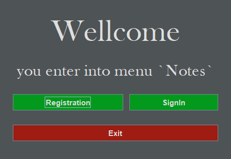
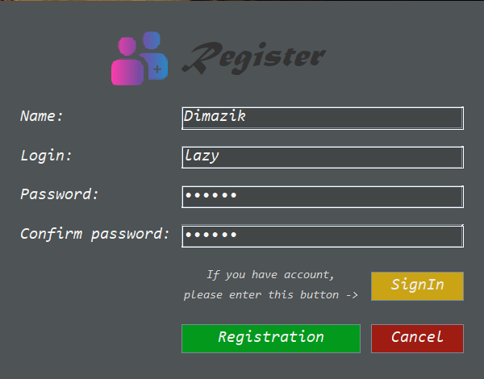
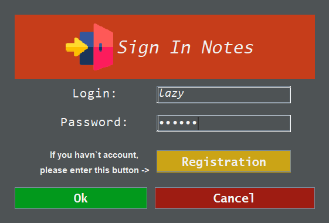
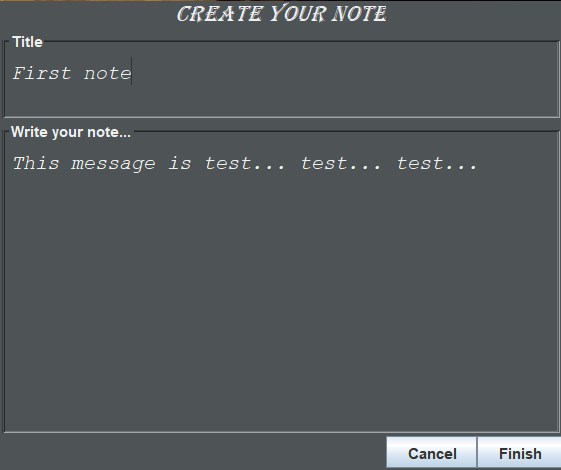

# Notes

## Preview from dima-coder =)!
1. This project uses jdk 11, JDBC driver, MySQL, Swing;
2. Folder called "out" stores 2 jar`s files: 1 - use 8 jdk, 2 - use 11 jdk;
3. In my project, the "Notes" application is implemented, 
in which each user can store his own notes for himself;
4. Project uses Swing interface;
5. Project uses db mySql to store information.

## Features
:white_check_mark:Sing in;
<br>:white_check_mark:Registration;
<br>:white_check_mark:Show notes owned by sign in system a user;
<br>:white_check_mark:Delete notes;
<br>:white_check_mark:Edit notes;
<br>:white_check_mark:Create notes.

## Usage
If you have downloaded a project and want to run it with your own database then you have to create enum which will be stored in a package src/guru/work/prog/dataenv and put your environment variables.
```java
public enum Environment {
    DB_URL("jdbc:RDBMS//host:port/nameDB"),
    USERNAME("username"),
    PASSWORD("password");

    private final String environmentValue;

    Environment(String environmentValue) {
        this.environmentValue = environmentValue;
    }

    public String getEnvironmentValue() {
        return environmentValue;
    }
}
```
And you can also just download and start jar`s, they use free host.

## Photo
### Main menu

### Registration

### Authorization

### Notes

- Those panel have table with user notes, he can click on the row and click "Select" in order to change or just see select note.<br>
- Also after clicking on row user can click minus and row will delete.<br>
- User can create own note.
### Create Note
